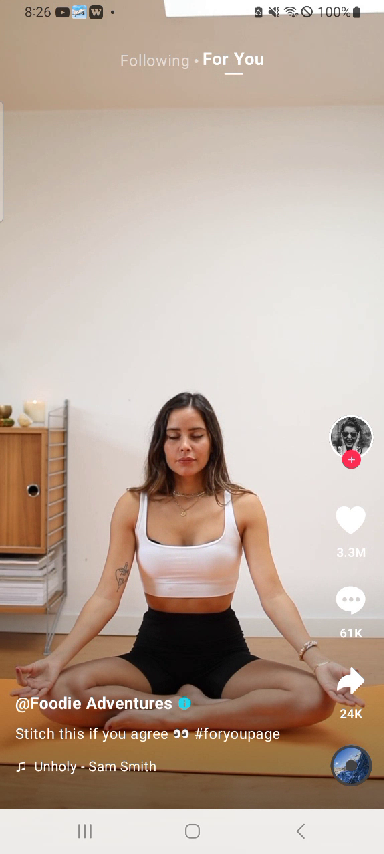

# MiniTikTok
A lightweight MiniTikTok Android app built to demonstrate Clean Architecture and advanced media processing techniques. This project showcases video playback, rendering, and encoding using ExoPlayer, MediaCodec, FFmpeg, and OpenGL.

## App Screenshot

Here’s how the app looks:

